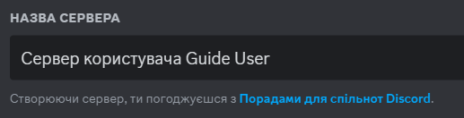
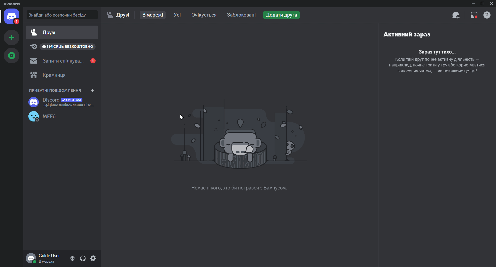

# Створення нового серверу

1. Щоб створити новий сервер натисніть на іконку  зліва.
2. Оберіть потрібний вам шаблон або зробіть власний.
3. Оберіть тип вашого серверу (Для друзів, Спільнота або пропустити питання).
4. Якщо потрібно завантажте логотип для серверу. 
5. Напишіть назву вашого серверу в полі назви серверу.

  

6. Натисніть кнопку "Створити" 

<h3 align="center"></h3>

<h2 style="text-align: center;">Вітаю, Ви створили ваш новий сервер!</h4>

Далі ви можете перейти до:
- Налаштування серверу (TODO)
	- Налаштування ролей (TODO)
	- Налаштування каналів (TODO)
